# Lab 07 – Managing Azure Storage (AZ-104)

## 📘 Overview

This lab demonstrates hands-on experience with **Azure Storage services** as part of the **AZ-104: Microsoft Azure Administrator** learning path.  
The objective of this lab was to explore how Azure Storage can be configured, secured, and integrated with networking features to support real-world enterprise use cases.

The work focuses on **cost optimization**, **security controls**, **data lifecycle management**, and **network-restricted access** for storage resources.

> ⏱️ **Lab duration:** ~50 minutes  
> 🔧 **Environment:** Azure Portal, Azure Storage, Virtual Network

---

## 🧭 Scenario Context

In a typical enterprise environment, organizations often maintain large volumes of **infrequently accessed data** on-premises. This lab simulates a migration scenario where such data is moved to Azure to:

- Reduce storage costs using tiering and lifecycle policies
- Improve durability and availability using Azure redundancy options
- Secure access using network-level and identity-based controls
- Centralize file and blob storage for controlled access

---

## 🧩 Azure Services Explored

The following Azure services and features were used in this lab:

- **Azure Storage Account**
- **Blob Storage**
- **Azure File Shares**
- **Lifecycle Management Policies**
- **Shared Access Signatures (SAS)**
- **Virtual Networks (VNet)**
- **Storage Firewalls & Network Rules**

---

## 🔍 Key Implementation Highlights

### 🔹 Storage Account Configuration
- Standard performance storage account with **Geo-Redundant Storage (GRS)** for high availability
- Public network access disabled to reduce exposure
- Firewall rules configured to allow access only from trusted networks and client IPs

### 🔹 Data Lifecycle Management
- Lifecycle rule configured to automatically move blobs to a cooler access tier after 30 days
- Demonstrates cost optimization for infrequently accessed data

### 🔹 Secure Blob Storage
- Private blob container configuration
- Retention policy applied for data governance
- Use of **Shared Access Signature (SAS)** to validate controlled, time-bound access

### 🔹 Azure File Storage with Network Restriction
- Azure File Share created for centralized file access
- Backup disabled to reduce unnecessary cost for this scenario
- Storage access restricted to a **Virtual Network**, ensuring private connectivity

---

## 📸 Visual Evidence (Screenshots)

The screenshots below capture key stages of the implementation and configuration.

### Storage Account & Network Configuration
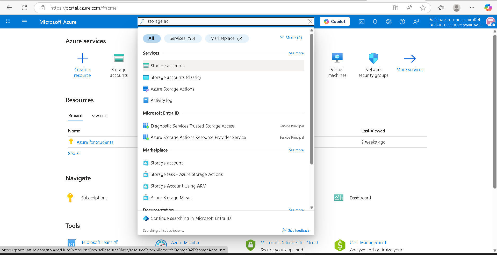
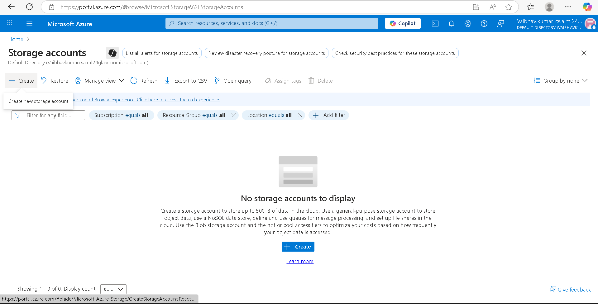
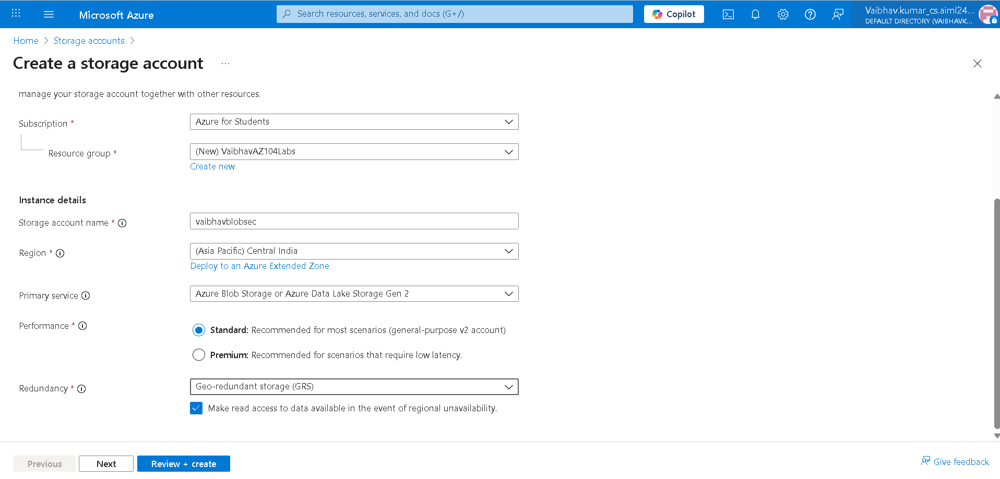
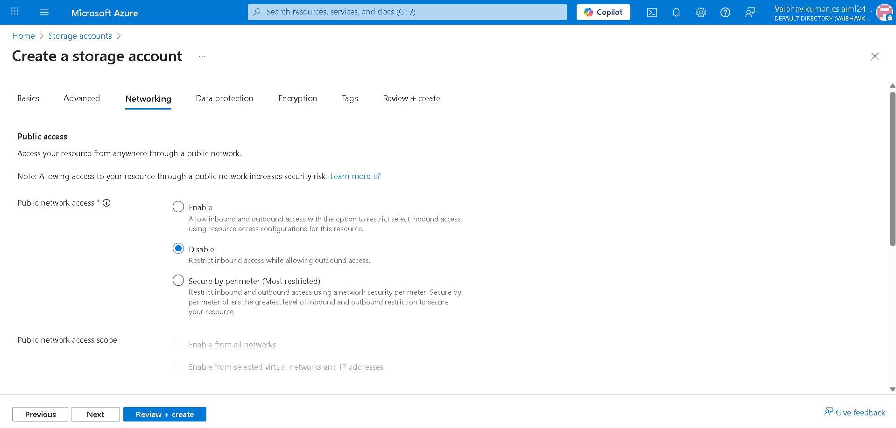
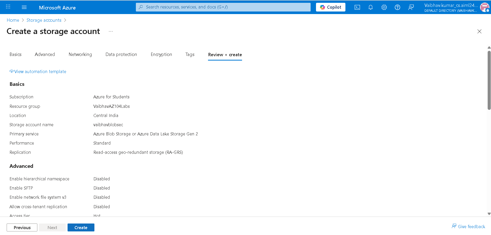
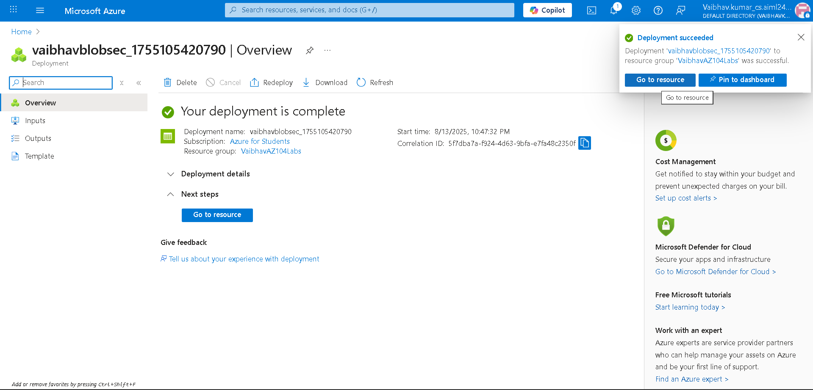
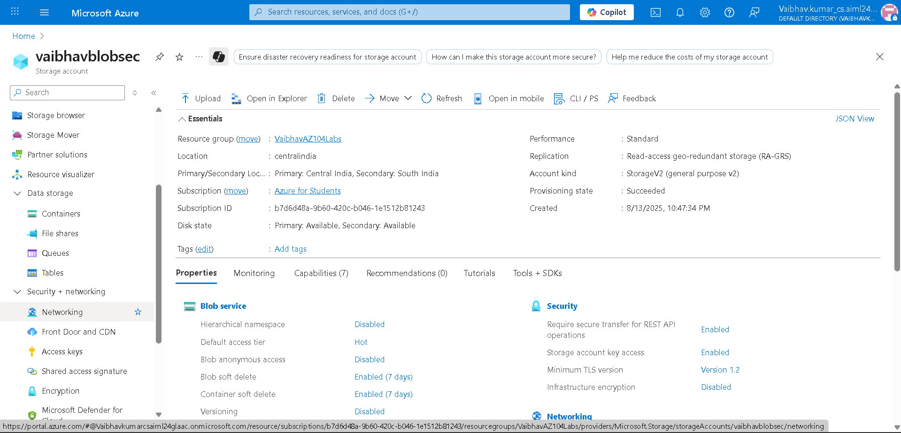
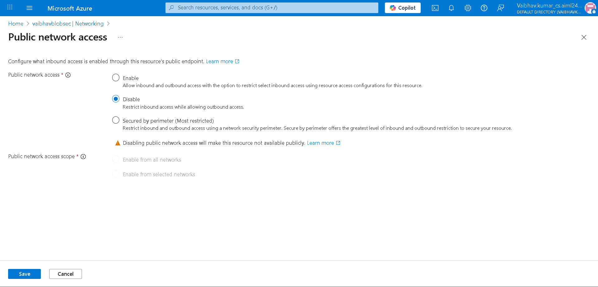
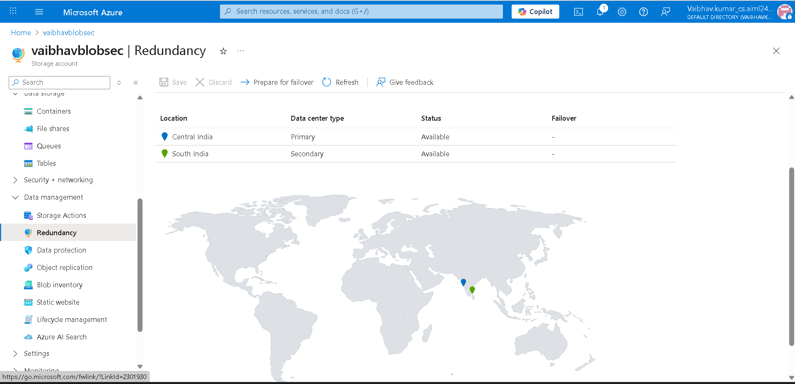

### Lifecycle Management
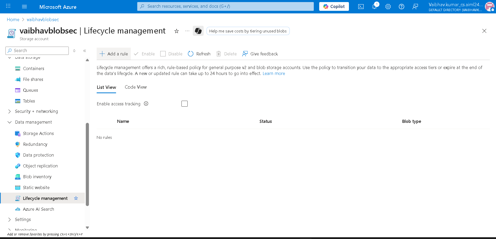
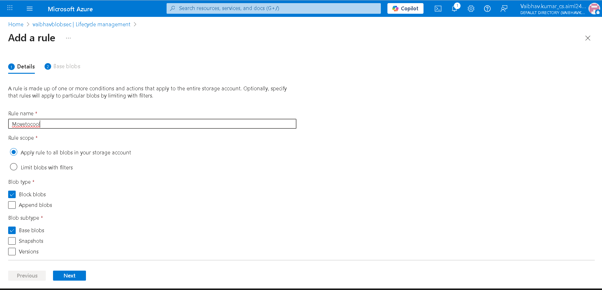

### Blob Storage & Access Control
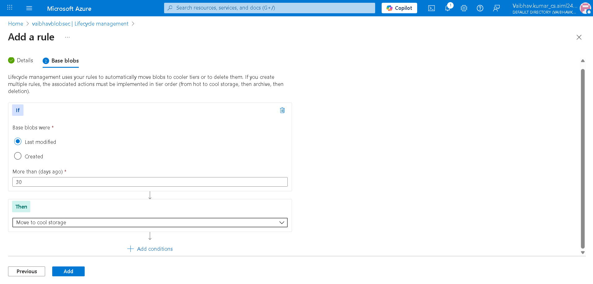
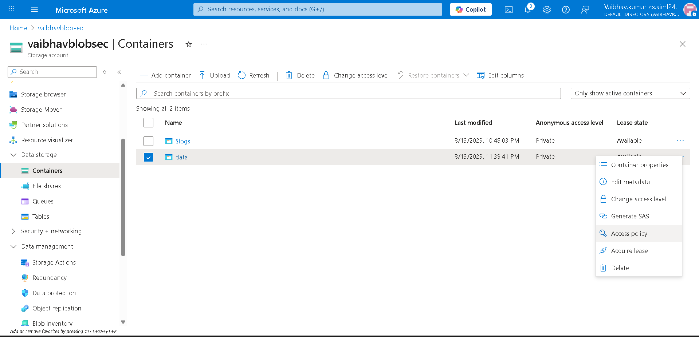
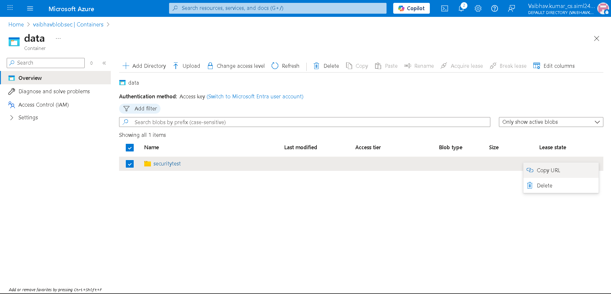
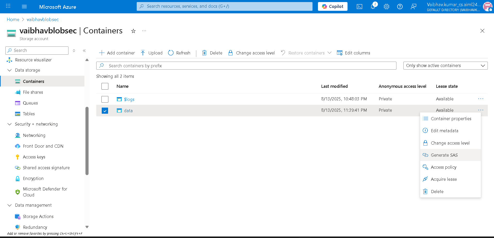
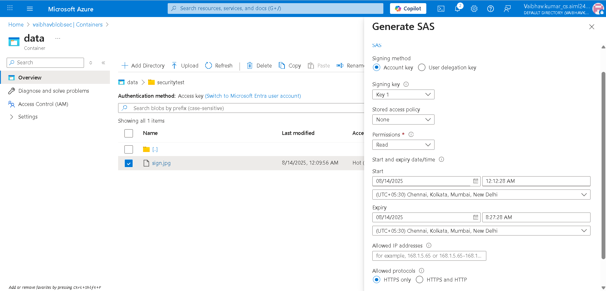

### Azure File Share & Virtual Network
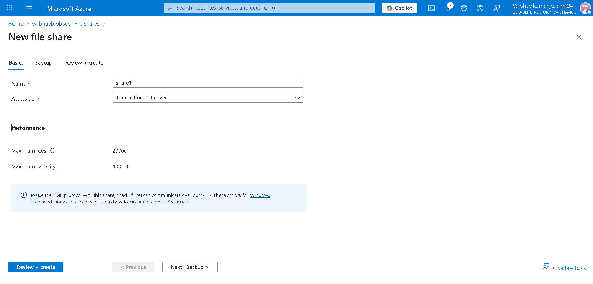
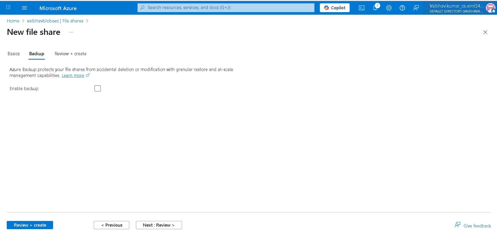
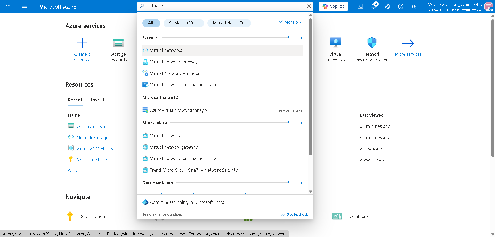
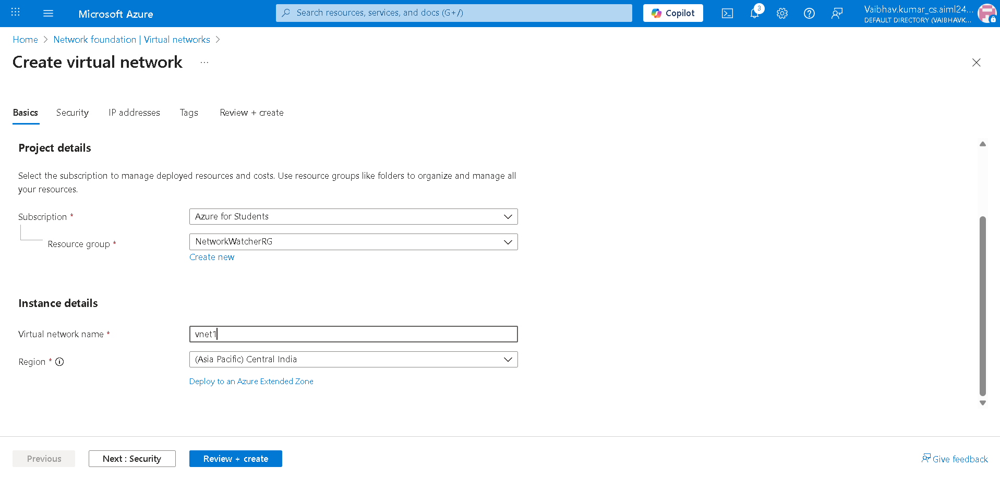
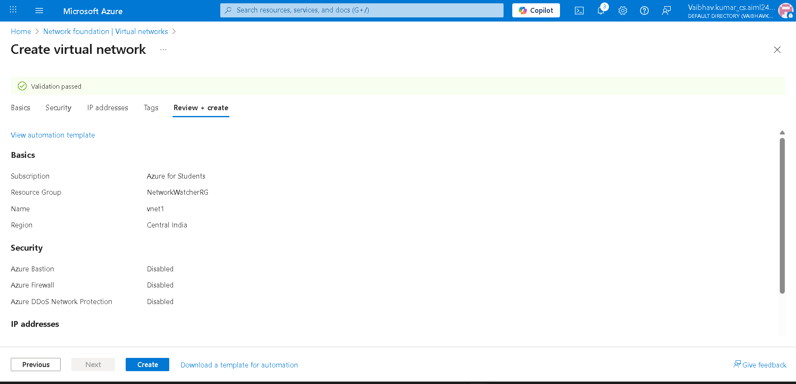

---

## 🧠 Key Takeaways

- Azure Storage provides granular control over **security, cost, and access**
- Lifecycle policies are essential for managing long-term storage costs
- Network-based access restrictions significantly improve storage security
- SAS tokens enable temporary and scoped access without exposing credentials
- Integrating storage with VNets aligns with enterprise security best practices

---

## 🧹 Resource Cleanup

All resources created during this lab were deleted after completion to avoid ongoing costs.

```powershell
# PowerShell
Remove-AzResourceGroup -Name az104-rg7

# Azure CLI
az group delete --name az104-rg7

